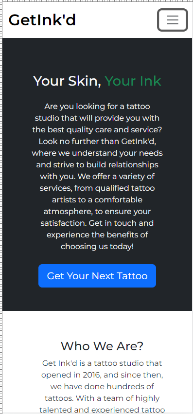
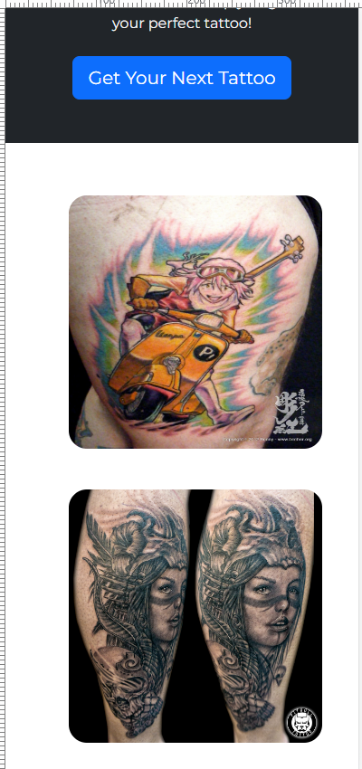
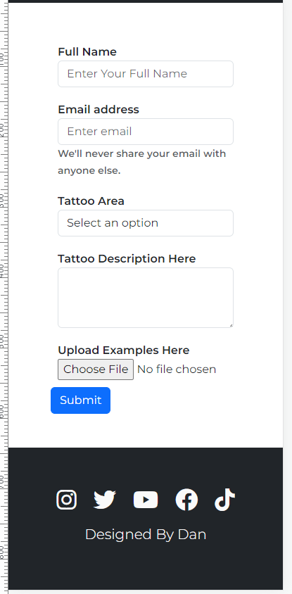
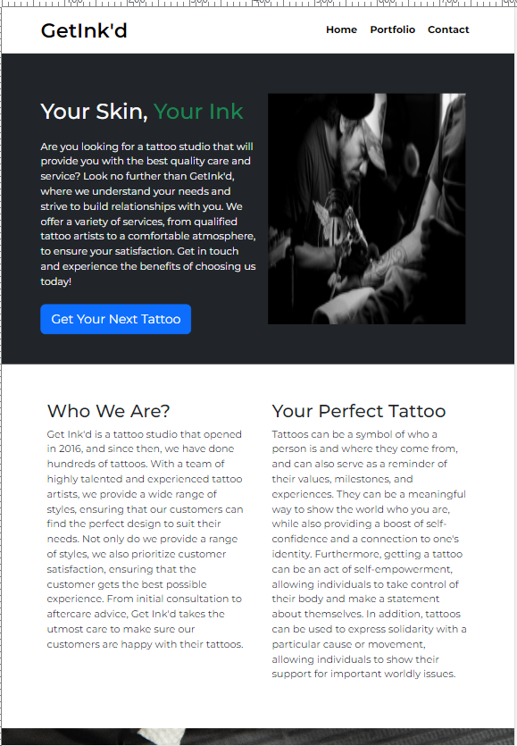
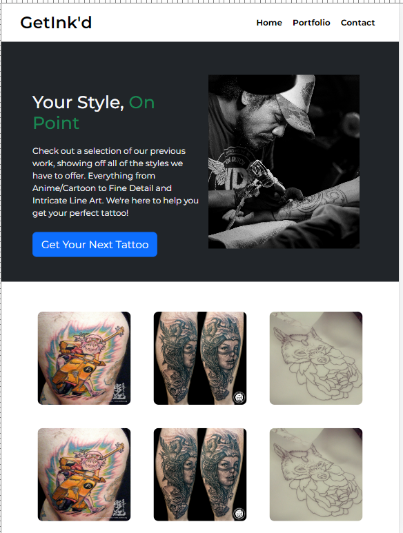
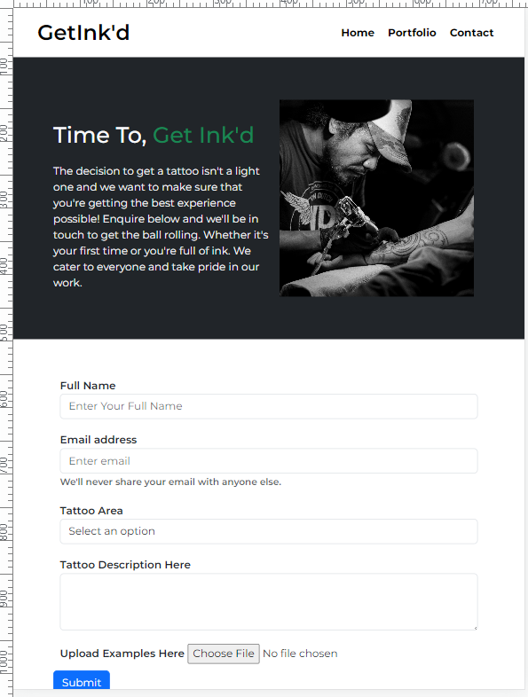

# GetInk'd

A website built to act as a portfolio and one stop shop for tattoo artists/studios to increase their visibility online.

## Built Using:
<strong>

</strong>
 
<strong>

</strong>

 

### Future Features:

* Full Animated Portfolio
* Interactive Tattoo Area Picker
* Live Chat*

### Testing

* Testing Approach:
    * Using Chrome Developer Tools to test the functionality of my website for responsiveness in the mobile first design.

* <strong>iPhone 12 Pro Testing:</strong>

    

        
        
        
    

 
 

* <strong>iPad Air Testing:</strong>

    

        
        
        
    

 

## Additional Documentation and Acknowledgments

* README Template - https://github.com/me-and-company/readme-template#readme
* Bootstrap - https://getbootstrap.com/
* FontAwesome - https://fontawesome.com/
* W3Schools - https://www.w3schools.com/howto/howto_css_parallax.asp
