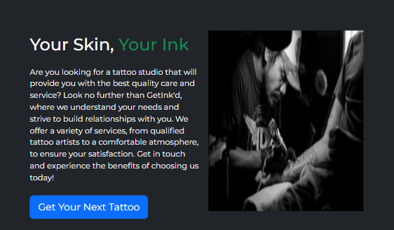
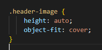
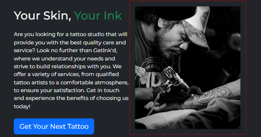
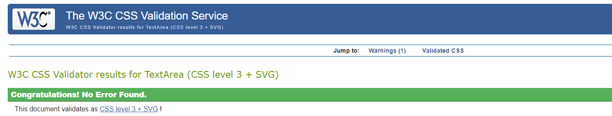

# GetInk'd

A website built to act as a portfolio and one stop shop for tattoo artists/studios to increase their visibility online.

Value added by allowing tattoo artists to showcase their work in a permanent platform that they have control over, versus the vast majority who rely on social media platforms that they have no hosting control over.

## User Stories
As the customer, I need to be able to see that there is a clear way to find the artist's previous work, what styles they are proficient in and the ability to contact them so I can easily enquire about their services as a tattoo artist.

## Built Using:
<strong>

</strong>
 
<strong>

</strong>

 

### Future Features:

* Fully Animated Portfolio
* Interactive Tattoo Area Picker
* Live Chat

### Testing

* Testing Approach:
    * Using Chrome Developer Tools to test the functionality of my website for responsiveness in the mobile first design.

* <strong>iPhone 12 Pro Testing:</strong>

    

        
        
        
    

 
 

* <strong>iPad Air Testing:</strong>

    

        
        
        
    

 

## Bugs and Fixes
 

    

    
1. The initial problem was that the image was completely distorted on mobile as it wasn't scaling correctly

        
    
2. To rectify this, I applied a class to the image and changed the height and object-fit properties so that the image would scale correctly in the boundaries

        
    
3. This is the result of the implemented code

        
    

 

## Additional Documentation and Acknowledgments

* README Template - https://github.com/me-and-company/readme-template#readme
* Bootstrap - https://getbootstrap.com/
* FontAwesome - https://fontawesome.com/
* W3Schools - https://www.w3schools.com/howto/howto_css_parallax.asp

 

## CSS Validated
